# Blitzblick – Anleitung für Eltern und Lehrkräfte

Diese Anleitung zeigt dir, wie du Blitzblick für ein Kind einrichtest und was du im Elternbereich einstellen kannst. Die Bilder stammen aus der echten App (Stand: Version 1.9.0) mit Demo-Daten.

**Inhalt**

- [Kurzüberblick](#kurzüberblick)
- [App öffnen und installieren](#app-öffnen-und-installieren)
- [Erster Start: Profil anlegen](#erster-start-profil-anlegen)
- [Die vier Übungen](#die-vier-übungen)
- [Eine Runde spielen](#eine-runde-spielen)
- [Sterne, Sticker und Album](#sterne-sticker-und-album)
- [Level und Anzeigedauer](#level-und-anzeigedauer)
- [Der Elternbereich](#der-elternbereich)
- [Daten sichern und übertragen](#daten-sichern-und-übertragen)
- [Tipps](#tipps)
- [Häufige Fragen](#häufige-fragen)

## Kurzüberblick

Blitzblick trainiert das schnelle Erfassen auf einen Blick, für Vorschulkinder und Erstklässler. Mengen, Zahlen, Buchstaben oder Silben und kurze Wörter blitzen für einen Moment auf. Danach tippt das Kind auf die Antwort, die es gesehen hat.

- Vier Übungen: Mengenblitz, Zahlenblitz, Buchstabenblitz, Silbenblitz.
- Eine Runde besteht aus 5 Aufgaben. Für jede richtige Antwort gibt es einen Stern.
- Mit Sternen tauscht das Kind im Album Sticker-Tüten gegen Sticker ein.
- Die Schwierigkeit passt sich automatisch an.
- Alle Daten bleiben auf dem Gerät. Es gibt kein Konto und keine Anmeldung.

## App öffnen und installieren

Die App läuft im Browser, auf Tablet, Handy und PC: <https://matthias-coder.github.io/blitzblick/>

Am Tablet oder Handy kannst du den QR-Code mit der Kamera scannen:

*Der QR-Code öffnet die App direkt.*

**Als App installieren:**

1. Öffne die Adresse im Browser des Geräts.
2. Wähle im Browser „Zum Home-Bildschirm“ (am iPad und iPhone im Teilen-Menü von Safari; andere Browser nennen die Funktion ähnlich).
3. Starte Blitzblick danach über das Symbol auf dem Home-Bildschirm. Die App öffnet sich dann ohne Browserleiste im Vollbild.

**Offline:** Nach dem ersten Öffnen mit Internet lädt sich die App auf das Gerät und funktioniert danach auch ohne Verbindung. Öffne sie am besten einmal zu Hause, bevor ihr unterwegs spielt.

## Erster Start: Profil anlegen

Beim allerersten Start begrüßt der Roboter das Kind. Mit „Los geht’s“ kommst du zum Formular.

1. Trage den **Namen** des Kindes ein (höchstens 20 Zeichen).
2. Wähle ein **Bild** aus den zwölf Figuren.
3. Trage im Kasten „Für Eltern“ das **Alter** ein. Ab 6 Jahren schlägt die App „Klasse 1“ vor, jünger „Vorschule“. Du kannst die Klasse selbst umstellen.
4. Tippe auf „Profil anlegen“.

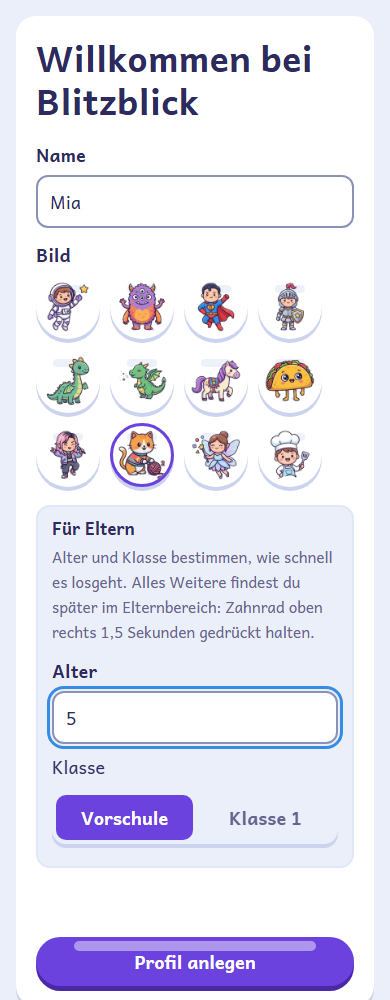

*Name und Bild wählt das Kind, Alter und Klasse bestimmen die Eltern.*

Die Klasse legt fest, wie schnell es losgeht und wie die Level aufgebaut sind (siehe [Level und Anzeigedauer](#level-und-anzeigedauer)). Alle weiteren Einstellungen findest du später im [Elternbereich](#der-elternbereich).

**Mehrere Kinder:** Legst du mehrere Profile an (im Elternbereich), startet die App mit der Auswahl „Wer bist du?“. Im Menü wechselt das Kind über das Bild links oben das Profil.

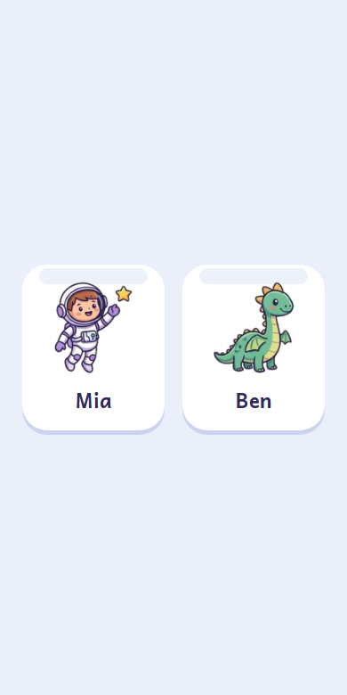

*Bei mehreren Profilen wählt das Kind beim Start sein Bild.*

## Die vier Übungen

Das Menü zeigt vier große Kacheln. Oben links steht das Profilbild, daneben der Sternestand. Rechts oben ist das Zahnrad für den Elternbereich, unten der Album-Knopf mit der Zahl der gesammelten Sticker.

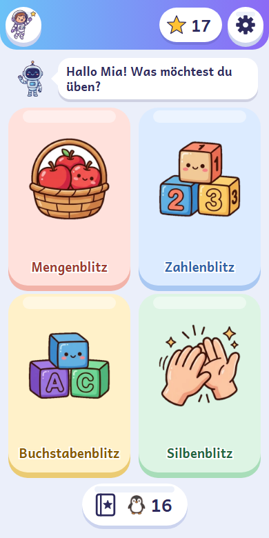

*Das Menü: vier Übungen, Sternestand, Zahnrad und Album mit Sticker-Zähler.*

| Übung | Was das Kind sieht | Was es antwortet |
| --- | --- | --- |
| **Mengenblitz** | Eine Gruppe gleicher Bilder, z. B. Äpfel oder Marienkäfer. Je nach Level in Mustern, durcheinander, im Zwanzigerfeld oder als Plus-Aufgabe. Manchmal Finger statt Bilder und manchmal zwei Gruppen zum Vergleichen. | Wie viele es waren. |
| **Zahlenblitz** | Eine Ziffer oder Zahl, in höheren Leveln eine Plus- oder Minus-Aufgabe. | Welche Zahl es war bzw. das Ergebnis. |
| **Buchstabenblitz** | Ein Buchstabe, standardmäßig auf Schreiblinien. Es kommen nur Buchstaben vor, die du im Elternbereich als bekannt angehakt hast. | Welcher Buchstabe es war. |
| **Silbenblitz** | Eine Silbe oder ein kurzes Wort, nur aus bekannten Buchstaben und immer richtig groß oder klein geschrieben. Silben sind farbig (blau/rot) als Lesehilfe. | Welche Silbe bzw. welches Wort es war. |

Der Silbenblitz erscheint nur im Menü, wenn genug Silben und Wörter aus den bekannten Buchstaben spielbar sind. Ist das nicht der Fall, steht im Elternbereich ein Hinweis, und du kannst weitere Buchstaben anhaken.

## Eine Runde spielen

1. Das Kind tippt eine Kachel an.
2. Ein pulsierender Punkt und, bei eingeschalteten Tönen, ein Countdown („tick – tick – Ping“) kündigen das Aufblitzen an.
3. Die Aufgabe blitzt kurz auf und verschwindet dann.
4. Auf der Karte steht jetzt ein „?“. Darunter erscheinen die Antwortknöpfe, und das Kind tippt auf die Antwort, die es gesehen hat.
5. Nach 5 Aufgaben endet die Runde.

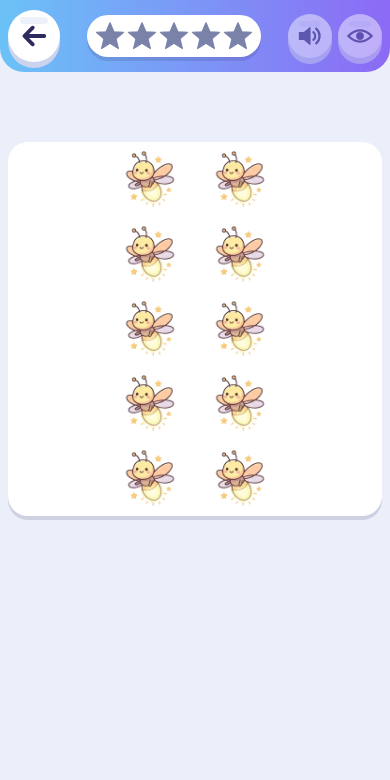

*Der Moment des Aufblitzens: Die Aufgabe ist nur kurz zu sehen.*

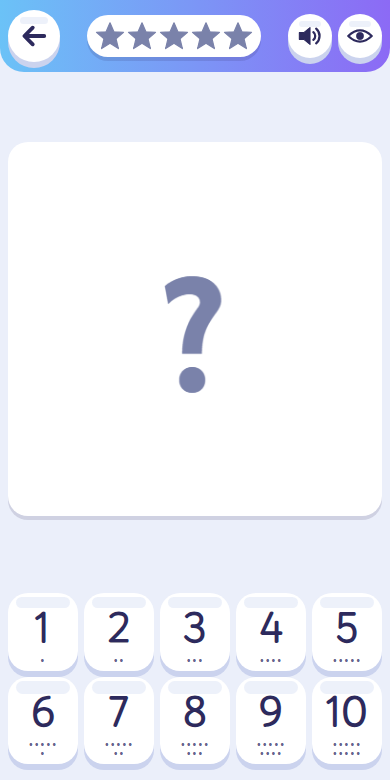

*Nach dem Blitz: Das Kind wählt die Zahl. Oben rechts liegen 🔊 und 👁.*

**Richtig oder falsch:** Bei einer richtigen Antwort jubelt der Roboter, und ein Stern fliegt in die Sternleiste oben. Bei einer falschen Antwort wird die Lösung noch einmal gezeigt, und der richtige Knopf wird markiert. Beim Zahlenblitz steht bei einer falschen Rechenantwort die ganze Rechnung da, z. B. „9 – 5 = 4“.

### Noch einmal hören oder sehen

Oben rechts gibt es zwei Knöpfe, sobald die Antwortknöpfe da sind:

- **🔊** spricht die Frage noch einmal. Der Knopf fehlt, wenn die Sprachausgabe auf „Aus“ steht.
- **👁** zeigt die Aufgabe noch einmal. Das geht einmal pro Aufgabe. Eine richtige Antwort danach gibt den Stern, macht das Spiel aber nicht schneller.

### Zurück mitten in der Runde

Tippt das Kind nach der ersten beantworteten Aufgabe auf den Pfeil links oben, fragt der Roboter „Weiter üben?“. Mit „Weiter“ geht es in der Runde weiter, mit „Beenden“ zurück ins Menü. Die Sterne der abgebrochenen Runde zählen dann nicht. Vor der ersten Antwort geht der Pfeil direkt zurück ins Menü.

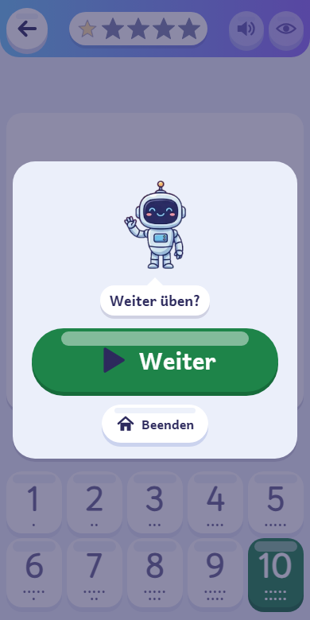

*Der Dialog „Weiter üben?“ erscheint, wenn das Kind mitten in der Runde auf Zurück tippt.*

### Beispielaufgabe beim ersten Start

Beim ersten Start jeder Übung (pro Kind) erklärt der Roboter mit „Schau genau hin – gleich ist es weg!“ kurz, worum es geht. Danach kommt eine langsame Beispielaufgabe, die keinen Stern bringt und die Schwierigkeit nicht beeinflusst. Erst danach beginnt die Runde.

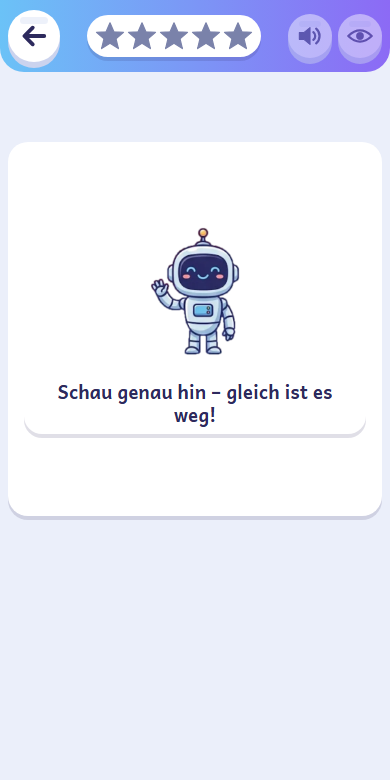

*Beim ersten Start jeder Übung zeigt der Roboter eine langsame Beispielaufgabe.*

### Vergleiche und Fingerbilder (Mengenblitz)

**„Wo ist mehr?“** Links und rechts blitzen zwei Gruppen auf, und das Kind tippt die Seite mit mehr. Das kommt ab Vorschule Level 2 bzw. Klasse 1 Level 1 etwa bei jeder dritten Aufgabe vor, höchstens zweimal pro Runde. Auf höheren Leveln kann auch „gleich viel“ richtig sein, und manchmal sind die Dinge in der kleineren Gruppe größer. Im Elternbereich kannst du die Vergleiche mit „Vergleiche einmischen“ abschalten.

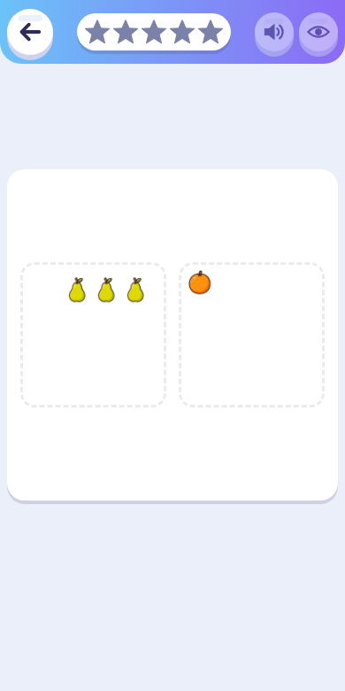

*„Wo ist mehr?“: links und rechts blitzt je eine Gruppe auf.*

**Fingerbilder:** In den Leveln „mit Muster“ erscheinen Mengen bis 10 manchmal als Finger. Bis 5 ist es eine Hand, darüber eine volle Hand plus der Rest.

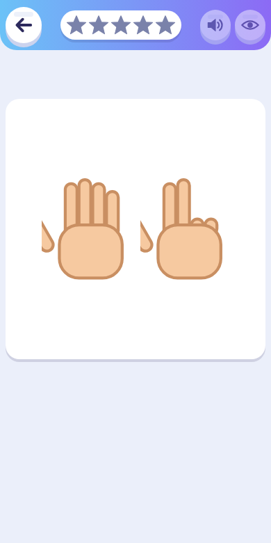

*Die Menge 8 als Fingerbild: eine volle Hand plus drei Finger.*

### Rundenende

Am Ende zeigt ein großer Stern die Zahl der richtigen Antworten. Der Ring um den Stern zeigt, wie nah die nächste Sticker-Tüte ist. Darunter stehen drei Knöpfe:

- **Nochmal** startet dieselbe Übung neu.
- **Album** öffnet das Sammelalbum.
- **Fertig** (Haus) führt zurück ins Menü.

Reichen die Sterne für eine Tüte, erscheint zusätzlich „Sticker-Tüte öffnen!“. Hat das Kind ein neues Level erreicht, feiert der Roboter mit einem Pokal und einer Medaille mit der neuen Level-Nummer.

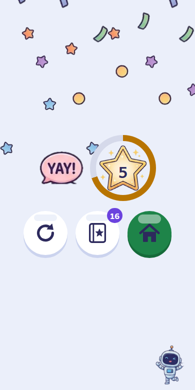

*Rundenende: der Stern zeigt die richtigen Antworten, der Ring den Weg zur nächsten Tüte.*

## Sterne, Sticker und Album

- Für jede richtige Antwort gibt es **einen Stern**. Der Sternestand steht im Menü und im Album oben rechts.
- Sticker gibt es nicht automatisch. Das Kind **tauscht Sterne im Album gegen Sticker-Tüten**. Eine Tüte enthält einen zufälligen Sticker der gewählten Albumseite.
- Der Preis richtet sich nach dem Level der Seite:

| Albumseite | Preis pro Tüte |
| --- | --- |
| Level 1 | 10 Sterne |
| Level 2 | 15 Sterne |
| Level 3 | 20 Sterne |
| Level 4 | 25 Sterne |
| Bonusseite | 30 Sterne |

- Doppelte Sticker zählen mit und zeigen eine Zahl. Nach höchstens drei Doppelten in Folge kommt ein neuer Sticker.
- Wer ein neues Level zum ersten Mal erreicht, bekommt Sterne im Wert einer Tüte dieser Stufe geschenkt.
- Hat ein Kind in einer Runde keine einzige richtige Antwort, findet es einen geheimen Sticker (höchstens einen pro Tag). Die geheime Seite „Unfug-Bande“ erscheint im Album erst, wenn der erste gefunden ist.

### Das Album

Das Album ist nach **Welten** geordnet: Mengen, Zahlen, Buchstaben und Silben, später kommt „Bonus“ dazu. Unter den Welten liegen die Seiten der gewählten Welt, jede mit einer Level-Nummer. Eine Seite öffnet sich, sobald das Kind in dieser Übung das Level erreicht hat. Bis dahin zeigt sie ein Schloss. Das Album öffnet bei der zuletzt gespielten Übung. Fehlende Sticker sind grau und tragen ein „?“.

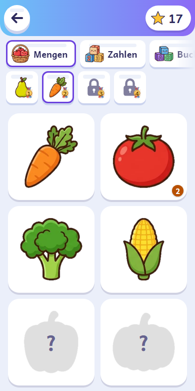

*Das Album: gesammelte Sticker in Farbe, fehlende als graue Umrisse mit „?“. Die „2“ am Sticker zeigt einen Doppelten.*

Unter den Stickern steht der Knopf **„Tüte öffnen“** mit dem Preis. Er ist ausgegraut, solange die Sterne nicht reichen. Nach dem Öffnen dreht sich der neue Sticker auf einem Overlay ein. Ein Tipp, Escape oder ein kurzer Moment schließt es wieder.

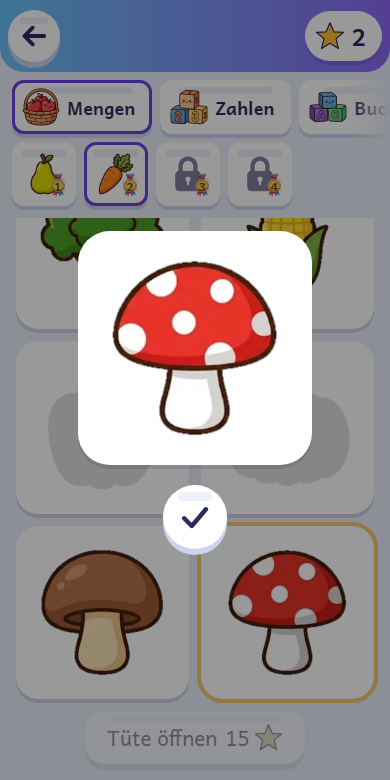

*Eine geöffnete Tüte: hier ein doppelter Sticker (×2).*

Die Seiten sind nach Übung und Level geordnet:

| Welt | Level 1 | Level 2 | Level 3 | Level 4 | Bonusseite |
| --- | --- | --- | --- | --- | --- |
| Mengen | Obst | Gemüse & Pilze | Leckereien | Essen | Garten |
| Zahlen | Spielzeug | Fahrzeuge | Weltraum | Klötzchenwelt | Baustelle |
| Buchstaben | Tiere | Meer | Dinos | Quatschwesen | Krabbeltiere |
| Silben | Mein Zimmer | Küche | Kochen | Zauberei | Alltagsfiguren |

Eine **Bonusseite** schaltet sich frei, wenn alle vier Seiten der Übung voll sind. Zur Freischaltung gibt es 30 Sterne dazu.

Auf dem Tablet im Querformat sieht das Album so aus:

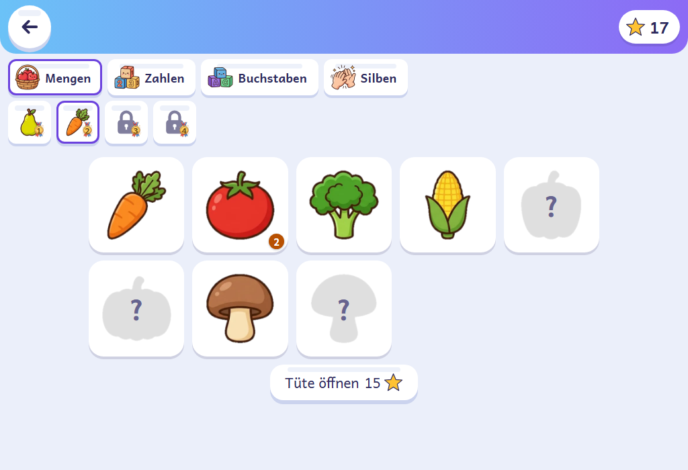

*Das Album im Querformat auf dem Tablet.*

## Level und Anzeigedauer

**Level:** Jede Übung hat pro Klassenstufe vier feste Level. Neue Profile starten überall auf Level 1.

| Übung | Vorschule | Klasse 1 |
| --- | --- | --- |
| Mengen | 1: bis 3 mit Muster 2: bis 5 mit Muster 3: bis 6, auch durcheinander 4: bis 10 mit Muster | 1: bis 10 mit Muster 2: bis 10 durcheinander 3: Plus bis 10 4: bis 20 im Zwanzigerfeld |
| Zahlen | 1: Zahlen 1–3 2: Zahlen 1–5 3: Zahlen 0–9 4: Zahlen 0–10 | 1: Zahlen 0–10 2: Zahlen 0–20 3: Plus bis 10 4: Plus und Minus bis 10 |
| Buchstaben | 1: Großbuchstaben, 3 Antworten 2: Großbuchstaben, 4 Antworten 3: Großbuchstaben, ähnliche zur Auswahl 4: Kleinbuchstaben | 1: Großbuchstaben 2: Kleinbuchstaben 3: groß und klein gemischt 4: gemischt, 6 Antworten |
| Silben & Wörter | 1: Silben, 3 Antworten 2: Silben, 4 Antworten 3: Wörter aus zwei offenen Silben 4: dieselben Wörter ohne Farbhilfe | 1: Silben 2: Wörter aus zwei offenen Silben 3: alle Wörter 4: alle Wörter ohne Farbhilfe |

Manche Level sind nur spielbar, wenn genug Buchstaben bekannt sind (z. B. 6 Antworten brauchen mindestens 4 bekannte Buchstaben). Sonst spielt die App das höchste spielbare Level darunter und zeigt dir im Elternbereich einen Hinweis.

**Anzeigedauer, automatisch:** Standardmäßig passt die App die Anzeigedauer an das Kind an.

- Bei 3 richtigen Antworten in Folge wird die Aufgabe kürzer gezeigt.
- Bei 2 falschen unter den letzten 3 Antworten wird sie länger gezeigt.
- Ist die kürzeste Dauer erreicht und weiter alles richtig, geht es innerhalb des Levels eine Stufe weiter. Am Ende des Levels gilt es als beherrscht.
- Plus- und Minus-Aufgaben werden 2,5-mal so lange gezeigt, „Wo ist mehr?“ 1,5-mal so lange.

**Level-Aufstieg:** Beherrscht das Kind ein Level, geht es am Rundenende automatisch ein Level höher, nie tiefer. Mit „Level festhalten“ im Elternbereich bleibt das Kind beim gewählten Level. Bei fester Anzeigedauer gilt immer das gewählte Level.

**Klassenstufen:** Jede Klassenstufe hat eigene Level und eigene Zeitgrenzen:

| | Start | Kürzeste | Längste |
| --- | --- | --- | --- |
| Vorschule | 2 s | 0,4 s | 3,5 s |
| Klasse 1 | 1,5 s | 0,3 s | 3 s |

## Der Elternbereich

### Öffnen

Das Kind soll hier nicht versehentlich landen, deshalb gibt es zwei Hürden:

1. Halte das **Zahnrad** oben rechts im Menü **1,5 Sekunden** gedrückt. Mit der Tastatur geht es genauso: Zahnrad fokussieren und Enter oder Leertaste 1,5 Sekunden halten.
2. Beantworte eine kleine **Rechenaufgabe** (Einmaleins, z. B. „Wie viel ist 5 × 3?“) und tippe auf „Weiter“. Bei einer falschen Antwort oder mit „Abbrechen“ geht es zurück ins Menü.

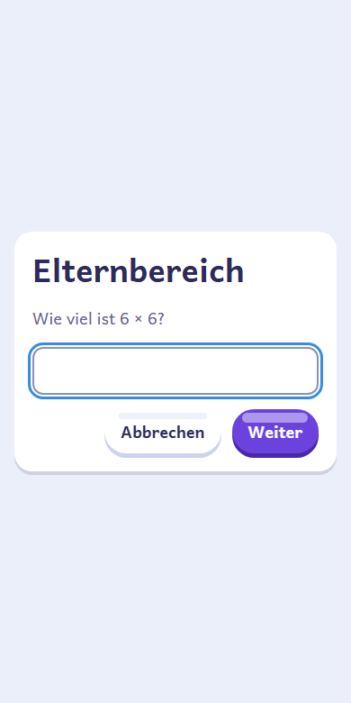

*Die Rechenaufgabe vor dem Elternbereich.*

Mit „Fertig“ oben rechts kommst du zurück ins Menü. Oben stehen vier Reiter: **Einstellungen**, **Fortschritt**, **Profile** und **Daten**.

### Einstellungen

Die Einstellungen gelten für das gerade aktive Kind („Einstellungen für Mia“).

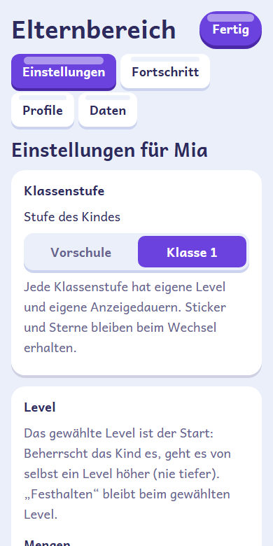

*Reiter „Einstellungen“: oben Klassenstufe und Level, darunter die weiteren Bereiche.*

| Bereich | Was du einstellst |
| --- | --- |
| **Klassenstufe** | Vorschule oder Klasse 1. Beim Wechsel fragt die App nach: Alle Übungen starten dann bei Level 1 der neuen Klassenstufe. Sticker und Sterne bleiben erhalten. |
| **Level** | Pro Übung das Start-Level (1 bis 4) und der Schalter „Level festhalten“. Beherrscht das Kind ein Level und ist nichts festgehalten, geht es von selbst höher. |
| **Übungsarten** | Jede Übung lässt sich ein- und ausschalten. Die letzte spielbare Übung bleibt immer an. |
| **Anzeigedauer** | „Automatisch anpassen“ an oder aus. Regler für Startwert (bei ausgeschalteter Automatik „Feste Dauer“), „Kürzeste“ und „Längste“ in Sekunden. |
| **Mengen** | „Vergleiche einmischen („Wo ist mehr?“)“ |
| **Buchstaben** | Welche Buchstaben das Kind schon kennt (mindestens 2; ab Werk A, M und O). Dazu „Buchstaben auf Schreiblinien zeigen (Lineatur 1)“ und die Aussprache: „Laut („mmm“)“ oder „Name („em“)“. |
| **Silben & Wörter** | „Silben farbig zeigen (blau/rot)“, die Anzahl der gerade spielbaren Silben und Wörter und **eigene Wörter**, z. B. Namen aus der Familie. Silben trennst du mit `\|` (El\|la), sonst trennt die App selbst. Namen und Nomen schreibst du groß. Es sind höchstens 50 eigene Wörter möglich. |
| **Ton** | Sprachausgabe „Aus“, „Wenig“ oder „Viel“, Stimme (pro Gerät), „Stimme testen“ und der Schalter „Töne“ (auch der Countdown vor dem Aufblitzen). |
| **Schwierigkeit** | „Alle auf Level 1 zurücksetzen“ (mit Rückfrage). |

Zur Sprachausgabe: „Wenig“ sagt nur die erste Frage einer Runde, die Lösungen und Lob an. „Viel“ sagt alles an. Findet die App keine deutsche Stimme, steht oben im Elternbereich ein Hinweis. Installiere dann in den Geräteeinstellungen eine deutsche Stimme. Am Android-Gerät gibt es unter Einstellungen → Sprachausgabe → Google natürlichere Stimmen zum Herunterladen.

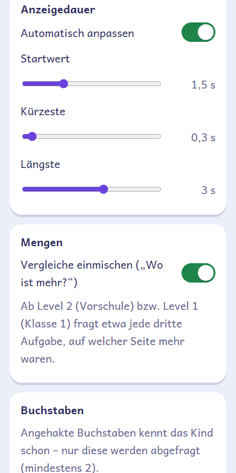

*Anzeigedauer und der Schalter „Vergleiche einmischen“.*

### Fortschritt

Pro Übung siehst du Klassenstufe, Level, Anzeigedauer („festgehalten“ und „beherrscht“ werden vermerkt), die Runden der letzten 7 Tage mit Trefferquote, ein Balkendiagramm der Runden pro Tag und „Oft verwechselt“ (z. B. „M → N“). Oben stehen der Sternestand und die Zahl der Sticker.

### Profile

Hier legst du Profile an, löschst sie und wählst das aktive Profil. Pro Profil kannst du Bild, Name und Alter ändern. „Löschen“ entfernt das Profil mit dem gesamten Fortschritt (mit Rückfrage). Unter „Neues Profil“ legst du weitere Kinder an.

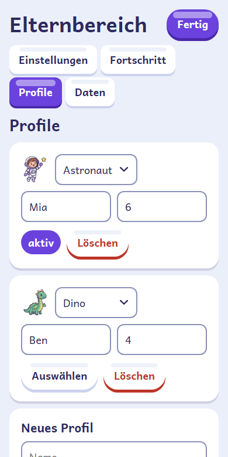

*Reiter „Profile“: Bild, Name und Alter ändern, Profil auswählen oder löschen.*

## Daten sichern und übertragen

Alle Profile, Einstellungen, der Fortschritt und die Sticker liegen nur auf dem Gerät. Im Reiter **Daten** machst du eine Sicherungsdatei:

1. **Sichern:** Tippe auf „Sicherung herunterladen“. Das Gerät speichert eine JSON-Datei.
2. **Einspielen:** Wähle unter „Sicherung einspielen“ die Datei aus und bestätige die Rückfrage. Der aktuelle Stand wird ersetzt, eine Kopie davon bewahrt die App automatisch auf. Danach meldet die App, wie viele Profile eingespielt wurden.

So überträgst du den Stand auf ein neues Gerät: Auf dem alten Gerät sichern, die Datei aufs neue Gerät bringen und dort einspielen.

## Tipps

- Eine Runde hat nur 5 Aufgaben. Lieber ein, zwei kurze Runden pro Tag als eine lange Sitzung.
- Lass das Kind die Antwort selbst antippen. Das 👁 ist für den Fall gedacht, dass es den Blitz verpasst hat.
- Mit eingeschalteter Sprachausgabe hört das Kind die Frage. Das 🔊 wiederholt sie. In ruhiger Umgebung oder mit Kopfhörern versteht es die Stimme besser.
- Fange mit den Buchstaben an, die das Kind wirklich kennt, und hake neue erst an, wenn es sie sicher erkennt. Silben und Wörter hängen davon ab.
- Die App läuft im Hoch- und im Querformat. Auf dem Tablet ist die Anzeige größer.
- Werden Aufgaben zu leicht oder zu schwer, kannst du im Elternbereich ein anderes Level wählen oder die Anzeigedauer fest einstellen.

## Häufige Fragen

**Funktioniert die App ohne Internet?**
Ja, nach dem ersten Öffnen mit Internet. Die App ist eine installierbare Offline-App.

**Wo liegen die Daten des Kindes? Wie steht es um den Datenschutz?**
Alle Daten liegen im Speicher des Browsers auf dem Gerät (localStorage). Die App hat kein Konto und keine Anmeldung. Die App sendet keine Daten des Kindes an einen Server. Die Sprachausgabe nutzt Stimmen des Geräts bzw. Browsers; manche, im Elternbereich mit „(online)“ gekennzeichnet, erzeugt das System möglicherweise über das Internet. Beim Löschen der Browserdaten gehen auch Fortschritt und Sticker verloren. Mach deshalb ab und zu eine [Sicherung](#daten-sichern-und-übertragen). Im privaten Modus mancher Browser lässt sich nicht dauerhaft speichern, dann warnt die App im Elternbereich.

**Kann ich mehrere Kinder anlegen?**
Ja, im Elternbereich unter „Profile“. Jedes Profil hat eigene Einstellungen, Sterne, Sticker und Level.

**Wie setze ich die Level zurück?**
Im Elternbereich unter „Einstellungen“ → „Schwierigkeit“ → „Alle auf Level 1 zurücksetzen“. Einzelne Übungen stellst du unter „Level“ um. Sterne und Sticker bleiben dabei erhalten.

**Das Kind hat die Klasse gewechselt. Was passiert mit den Stickern?**
Bei einem Wechsel der Klassenstufe starten alle Übungen wieder bei Level 1, Sticker und Sterne bleiben erhalten.

**Warum fehlt eine Übung im Menü?**
Sie ist im Elternbereich ausgeschaltet, oder es sind zu wenige Buchstaben bekannt. Beim Buchstabenblitz braucht die App mindestens 2 bekannte Buchstaben, beim Silbenblitz genug Silben und Wörter aus den bekannten Buchstaben. Im Elternbereich steht dann der Hinweis „Im Menü gerade ausgeblendet – zu wenige bekannte Buchstaben.“

**Es kommt kein Ton. Woran liegt das?**
Prüfe im Elternbereich unter „Ton“, ob die Sprachausgabe auf „Aus“ steht und ob „Töne“ eingeschaltet sind. Steht oben im Elternbereich der Hinweis „Keine deutsche Stimme gefunden“, installiere in den Geräteeinstellungen eine deutsche Stimme. Prüfe außerdem die Lautstärke des Geräts.

**Die Aufgabe verschwindet zu schnell oder bleibt zu lange.**
Im Elternbereich unter „Anzeigedauer“ stellst du Startwert, kürzeste und längste Dauer ein. Mit ausgeschalteter Automatik gilt eine feste Dauer.

**Ich komme nicht in den Elternbereich.**
Halte das Zahnrad volle 1,5 Sekunden gedrückt, ohne den Finger zu bewegen. Beantworte dann die Rechenaufgabe richtig. Mit der Tastatur: Zahnrad fokussieren, Enter oder Leertaste 1,5 Sekunden halten.
